<<<<<<< HEAD
hello ~GitHub~!
=======
# Myfile

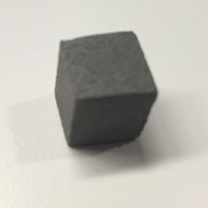 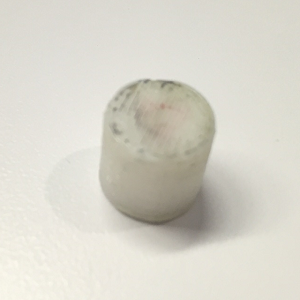

Figure 1: the objects that we reconstructed

|                       | 0                                        | 300                                      | 600                                      | 900                                      |
| :-------------------- | ---------------------------------------- | ---------------------------------------- | ---------------------------------------- | ---------------------------------------- |
| Original object       | 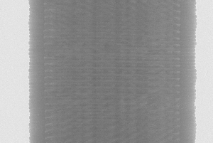 | 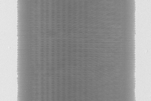 | 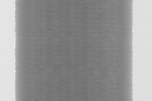 | 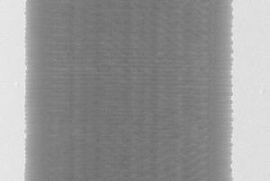 |
| Object after pressing | 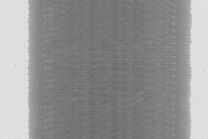 | 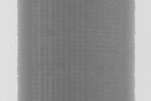 | 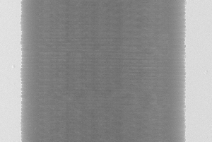 |  |

Figure 2: The projection images of object 1. From left to right: the projection images at different angle, from top to bottom: the projections that we got from the object before and after pressing, respectively. 

|                       | 0                                        | 300                                      | 600                                      | 900                                      |
| :-------------------- | ---------------------------------------- | ---------------------------------------- | ---------------------------------------- | ---------------------------------------- |
| Original object       | 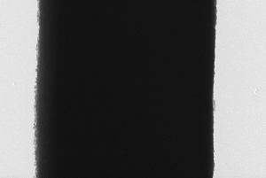 | 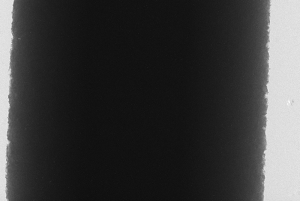 | 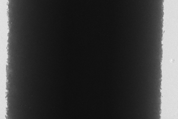 |  |
| Object after pressing | 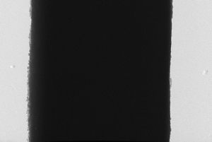 | 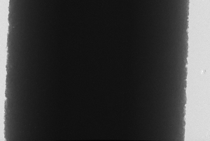 | 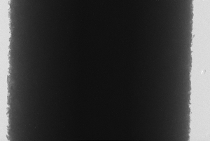 |  |

Figure3 : The projection images of object 2. From left to right: the projection images at different angle, from top to bottom: the projections that we got from the object before and after pressing, respectively. 

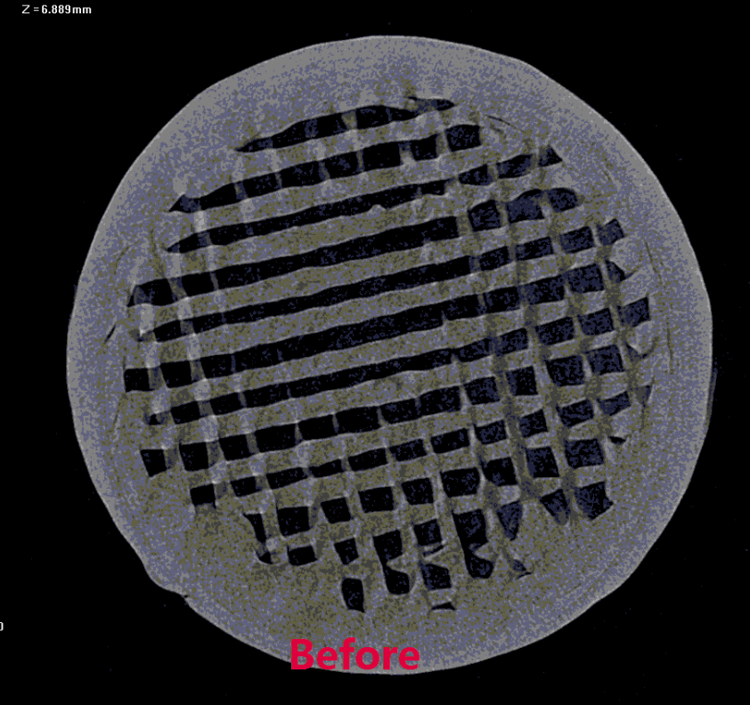 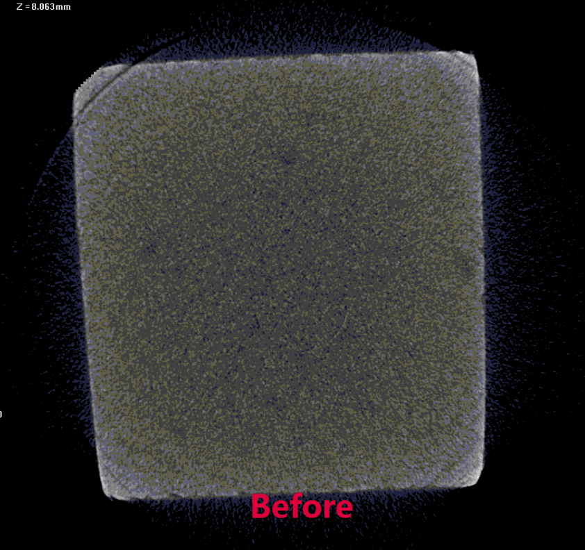

Figure 3: comparisons of central slice visualization of reconstructed volumes

origin/master
How are you?

plz contact me   abc@126.com